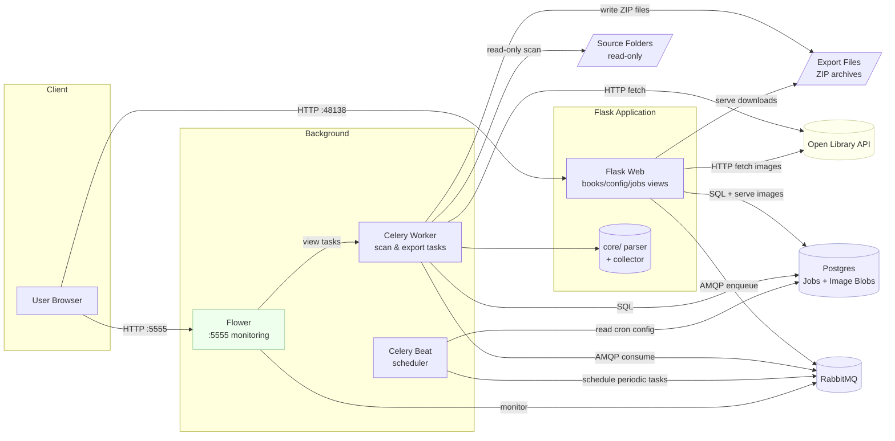

# Architecture Overview

## Diagram

## Components
- Flask Web App: Serves pages to browse and edit metadata; no auth (LAN only).
- Core Library (`core/`): Parsing/collection logic and pure utilities; easy to unit test.
- Celery Worker: Background tasks to read KoReader metadata, populate DB, export highlights, and clean up old jobs.
- Celery Beat: Scheduler for periodic tasks (scans, cleanup) using cron expressions from database config.
- Flower: Web-based monitoring UI for Celery tasks, workers, and queues (accessible at :5555).
- Postgres: Primary persistence for cleaned data, relationships, job records, and book cover images (stored as binary blobs).
- RabbitMQ: Broker for Celery tasks.

## Data Flow
+ Source (read-only): KoReader metadata files (e.g., `metadata.*.lua`) under `HIGHLIGHTS_BASE_PATH`.
+ Import: Celery scans paths → `core` parses → upsert into DB (no writes to source files). Scans can be triggered manually or run automatically on schedule via Celery Beat.
+ Manage: Flask UI edits cleaned fields (title, author, cover), searches Open Library and applies results, and merges highlights.
+ Images: Flask fetches cover images from external URLs (e.g., Open Library), stores them as binary blobs in Postgres (`image_data`, `image_content_type`), and serves them directly from the database.
+ Export: User selects highlights → Flask creates ExportJob → Celery renders Jinja2 template with configurable filenames → generates ZIP (markdown + cover) → stores in `EXPORT_DIR` → user downloads → optionally deletes job + file.
+ Jobs: All background tasks (scans, exports) tracked in unified Job/ExportJob tables. Old jobs automatically cleaned up based on retention policy (default: 30 days).
+ Monitoring: Flower provides real-time monitoring of Celery tasks, workers, queues, and task history.

## Models (SQLAlchemy)
- Book: id, raw_title, raw_authors, clean_title, clean_authors, external_url (stored in `goodreads_url`), image_url (deprecated), image_data (BYTEA blob), image_content_type, identifiers, language, created_at, updated_at.
- Highlight: id, book_id, text, chapter, page_number, datetime, color, device_id, page_xpath, kind, hidden (boolean), created_at.
- HighlightDevice: id, highlight_id, device_id (unique per highlight).
- Note: id, book_id, text, datetime, device_id, created_at.
- Bookmark: id, book_id, chapter, page_number, datetime, device_id, created_at.
- MergedHighlight: id, book_id, text, notes (optional), created_at.
- MergedHighlightItem: merged_id, highlight_id (preserve originals; mark as merged via relation).
- SourcePath: id, path, enabled, device_label.
- AppConfig: id, ol_app_name, ol_contact_email, scan_schedule (cron expression), job_retention_days (integer, default: 30).
- ExportTemplate: id, name, template_content (Jinja2), filename_template (Jinja2), cover_filename_template (Jinja2), is_default, created_at, updated_at.
- ExportJob: id, job_id (UUID), book_id, template_id, highlight_ids (JSON), status, error_message, file_path, completed_at, created_at, updated_at.
- Job: id, job_id (task ID), job_type (scan/export), status (pending/processing/completed/failed), error_message, result_summary (JSON), completed_at, created_at.

## Flask Structure
- app/
  - __init__.py (factory + config + Jinja filters: from_json, humandate, humandate_short)
  - views/
    - books.py (list, detail, edit inline, OL search/apply, merge UI, refresh, image upload/fetch, cover serving, hide/unhide highlights)
    - tasks.py (trigger rescan)
    - config.py (manage folders, Open Library identity, cron schedule validation, job retention policy)
    - exports.py (templates CRUD, export job creation, download, deletion)
    - jobs.py (unified jobs view showing all scan and export jobs)
  - services/
    - imagestore.py (fetch images from URLs)
    - openlibrary.py (API integration)
  - templates/
    - layout.html, books/*.html, config/*.html, exports/*.html, jobs/*.html
  - static/ (Bootstrap CSS/JS vendored or CDN, html2canvas.min.js)

## Celery
- `celery_app.py` with factory using Flask config.
- `celerybeat_schedule.py` with dynamic schedule loading from database.
- Tasks:
  - `scan_all_paths()` - scan all enabled source paths, create Job record with statistics (files scanned, new books, new highlights)
  - `scan_base_path(path)`, `import_file(path)` - import highlights from KOReader metadata
  - `export_highlights(job_id)` - render Jinja2 template with selected highlights and configurable filenames, create ZIP with markdown + cover image
  - `cleanup_old_jobs()` - delete Job and ExportJob records older than retention period, remove associated export files (scheduled daily at midnight)
- Dedupe highlights per book by (book_id, text) across all highlight variants and attach device tags.
- Scheduled tasks (via Celery Beat):
  - Periodic scans: Configurable cron schedule from AppConfig.scan_schedule (default: */15 * * * *)
  - Daily cleanup: Runs at midnight to remove old jobs based on AppConfig.job_retention_days (default: 30)

## Configuration
- Env vars: `DATABASE_URL`, `HIGHLIGHTS_BASE_PATH`, `EXPORT_DIR`, `RABBITMQ_URL`, `FLASK_ENV`.
- In-app config (AppConfig model):
  - Source folders with device labels
  - Open Library App Name + Contact Email (used for User-Agent)
  - Periodic scan schedule (cron expression, default: */15 * * * *)
  - Job retention policy (days, default: 30)
- `.env` for local compose; secrets not committed.
- Export templates stored in database (ExportTemplate model) with configurable filename templates for content and cover images.

## Non-goals
- Do not modify any KoReader files or JSON outputs; DB is the system of record for cleaned/merged data.

## Deployment
- Docker: multi-stage build generates `requirements.txt` from `pyproject.toml` via pip-compile, then installs with pip.
- Ports:
  - Web: 48138 (Flask app)
  - Flower: 5555 (Celery monitoring)
  - RabbitMQ: 5672 (AMQP), 15672 (management UI)
  - PostgreSQL: 5432
- Compose services: `db`, `rabbitmq`, `web`, `worker`, `beat`, `flower`.
- Images are stored as binary blobs (BYTEA) directly in PostgreSQL, eliminating the need for external image storage services.
- Job records and export files managed automatically via retention policy.
