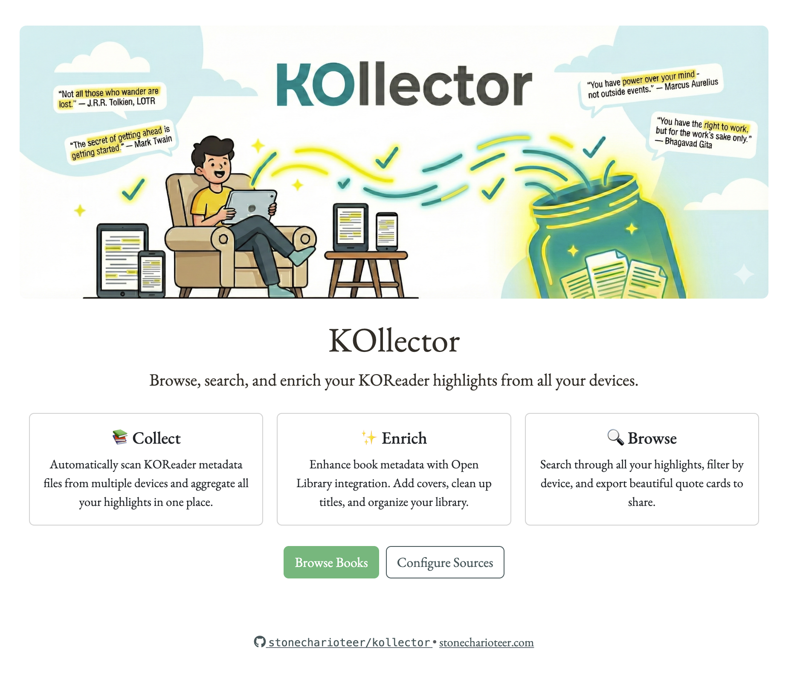
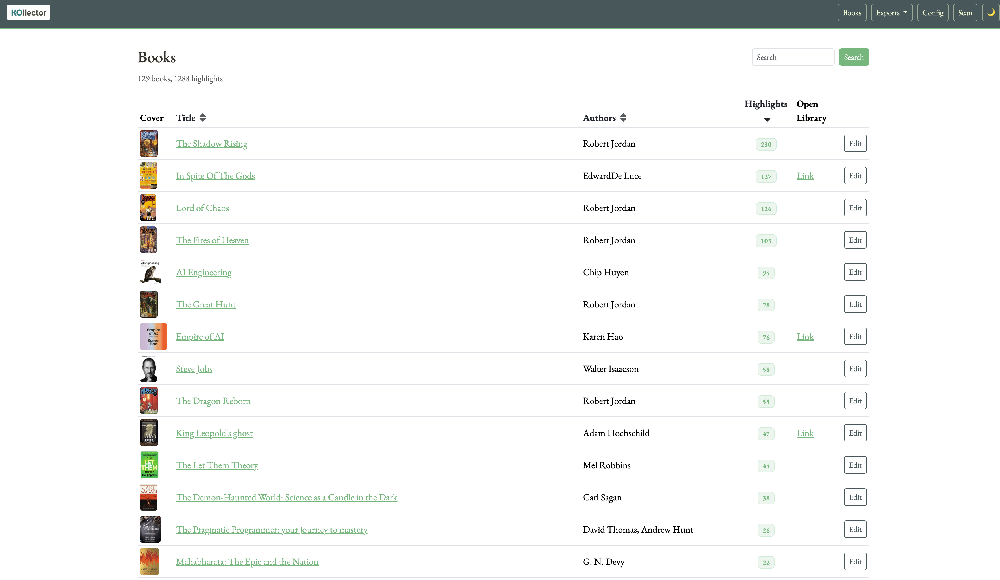
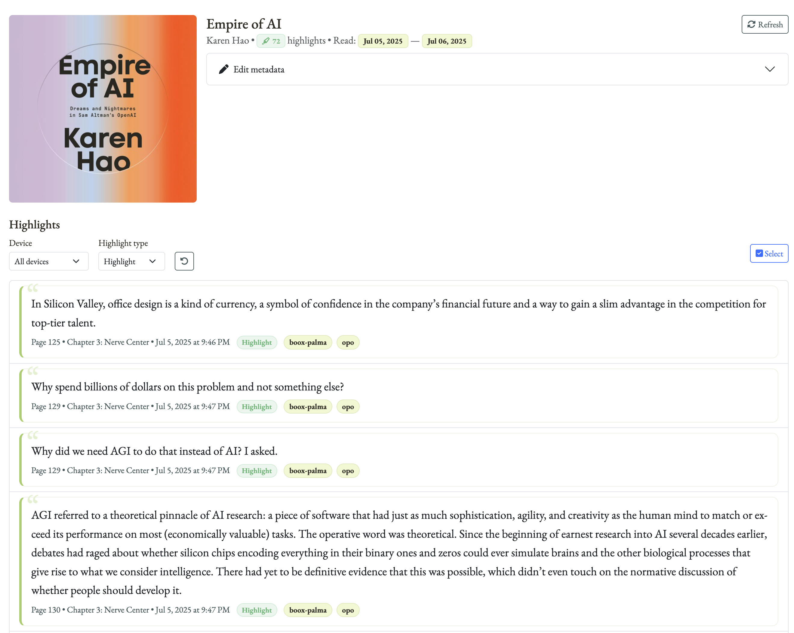
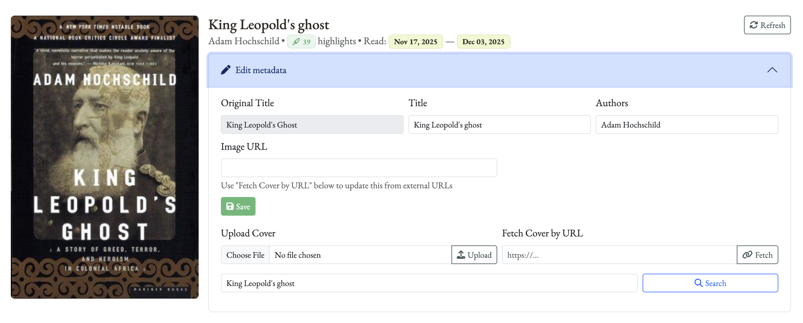
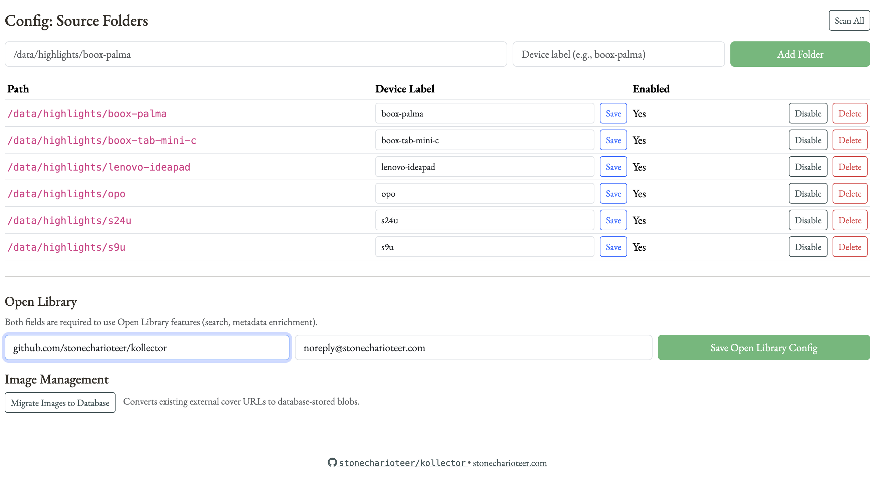
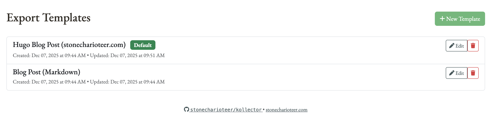
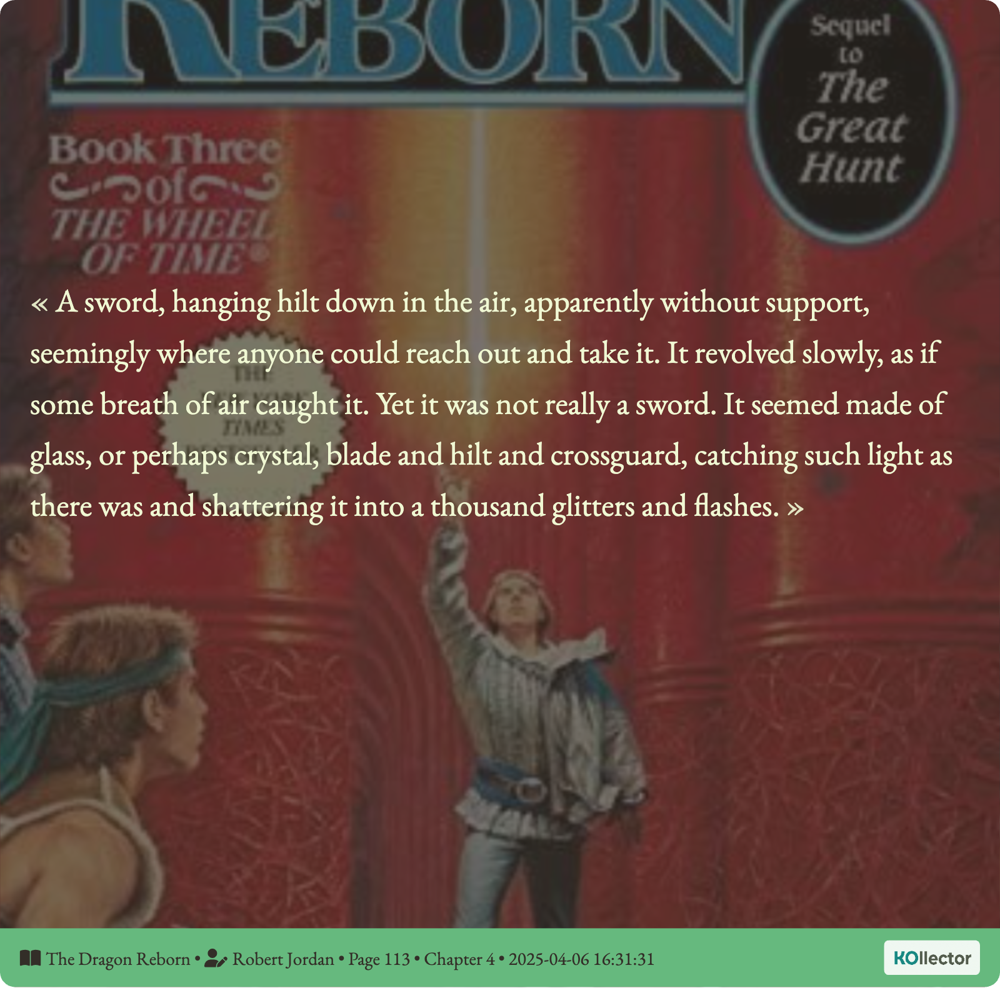

# KOllector Screenshots

This page provides a visual tour of KOllector's features and interface.

## Landing Page

The main landing page provides an overview of the application and quick access to key features.

## Book List

Browse all your imported books with cover thumbnails, highlight counts, and metadata. Use the search functionality to quickly find specific books.

## Book Detail Page

View all highlights from a book with device tags, highlight types, page numbers, and timestamps. Filter by device or highlight type to focus on specific content.

## Metadata Editor

Edit book metadata inline or search Open Library to enrich your book information. Upload custom covers or fetch them from URLs.

## Configuration

Manage source folders for your KOReader highlights, configure device labels, and set up Open Library API identity.

## Export Templates

Create and manage Jinja2 templates for exporting highlights to blog posts. The default Hugo template is included, and you can create custom templates for different platforms.

## Exported Quote

Generate beautiful, shareable quote images from your highlights with adaptive layouts and styling.

